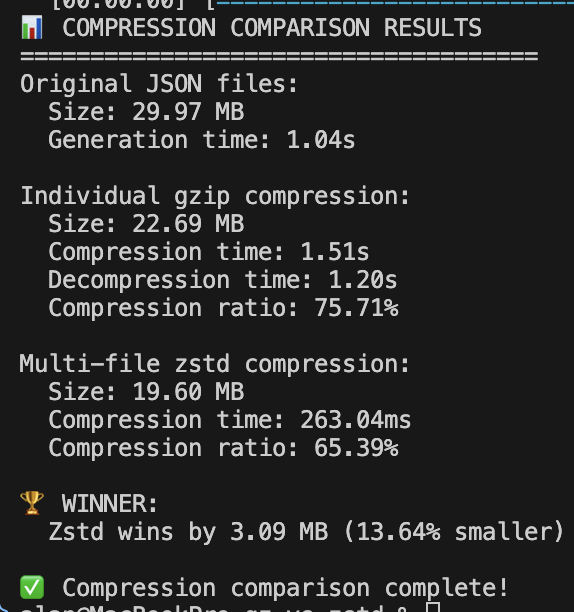

# Gzip vs Zstd Compression Comparison

Compares individual gzip vs multi-file zstd compression on 10k realistic JSON log files.

## Run

```bash
cargo run --release
```

## Results



[Watch it run](recording.mov)

## Output

```
📊 COMPRESSION COMPARISON RESULTS
=====================================
Original JSON files:
  Size: 29.97 MB
  Generation time: 1.04s

Individual gzip compression:
  Size: 22.69 MB
  Compression time: 1.51s
  Decompression time: 1.20s
  Compression ratio: 75.71%

Multi-file zstd compression:
  Size: 19.60 MB
  Compression time: 263.04ms
  Compression ratio: 65.39%

🏆 WINNER:
  Zstd wins by 3.09 MB (13.64% smaller)

✅ Compression comparison complete!
```

Progress bars show elapsed time, file count, and completion status.
